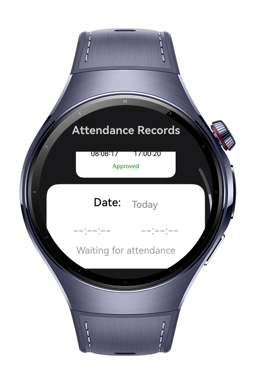
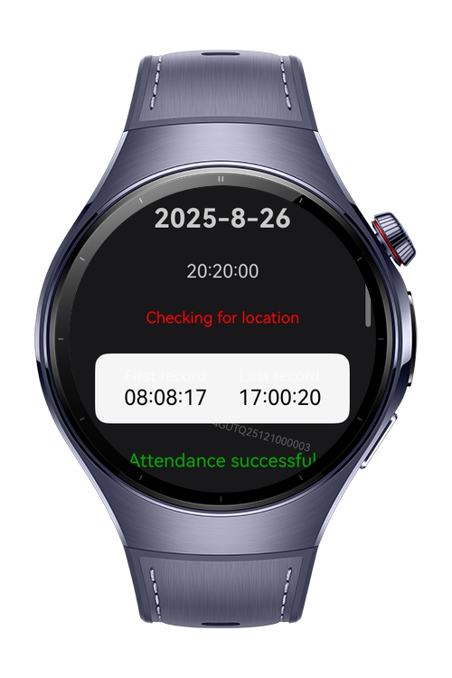
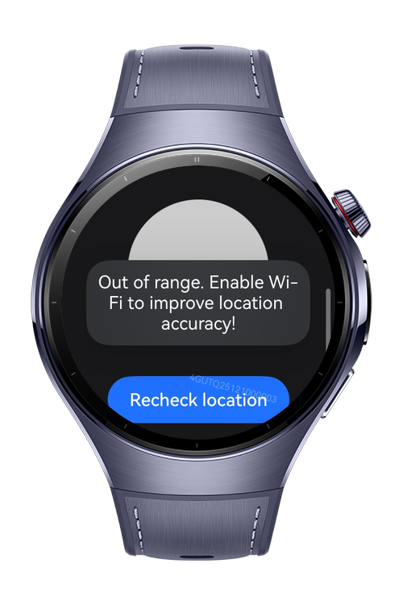
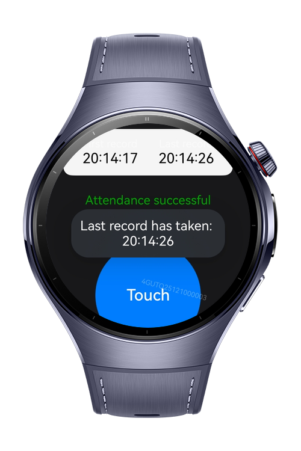

> **Note:** To access all shared projects, get information about environment setup, and view other guides, please visit [Explore-In-HMOS-Wearable Index](https://github.com/Explore-In-HMOS-Wearable/hmos-index).

# TakeAttendanceApp

This is a practical industrial application for the usages in attendance record systems and called as TakeAttendanceApp, built with ArkTS and ArkUI with intuitive location detection and sensor usage features, designed for HarmonyOS NEXT wearable devices. It leverages SensorKit and LocationKit with circular screen support.

# Preview

<div>
    
    
    
    
</div>


# Use Cases

This demo application provides:
- See the attendance history and details.
- Make attendance taking the device's location regarding if the device is in the restricted areas.
- Inform users if the attendance is successful with the control of the spesific time intervals.
- Inform users making vibrations if the attendance has been recorded using sensors.

# Tech Stack

- Languages: ArkTS (Ark TypeScript)

- Frameworks: Requires **DevEco Studio** (e.g. version 5.1.0.842)

- Tools: Requires **DevEco Studio** (e.g. version 5.1.0.842).

- Libraries & Kits:

- `@kit.SensorServiceKit`
- `@kit.LocationKit`
- `@kit.AbilityKit`
- `@kit.BasicServicesKit`
- `@kit.ArkUI`
- `@ohos.router`


# Project Directory

```
entry/src/main/ets/
ets/
│
├── components/
│   └── AttendanceCard.ets
│
├── entryability/
│   └── EntryAbility.ets
│
├── entrybackupability/
│   └── EntryBackupAbility.ets
│
├── models/
│   └── AttendanceRecord.ets
│
├── pages/
│   ├── AttendanceDetailPage.ets
│   ├── AttendanceMainPage.ets
│   └── Index.ets
│
├── services/
│   └── LocationService.ets
│
├── utils/
│   ├── PermissionUtils.ets
│   ├── PromptUtils.ets
│   └── RouterUtils.ets
│
resources/


```

# Constraints and Restrictions

## Supported Device
- Huawei Watch 5

# License

TakeAttendanceApp is distributed under the terms of the MIT License
See the [LICENSE](./LICENSE) for more information.


